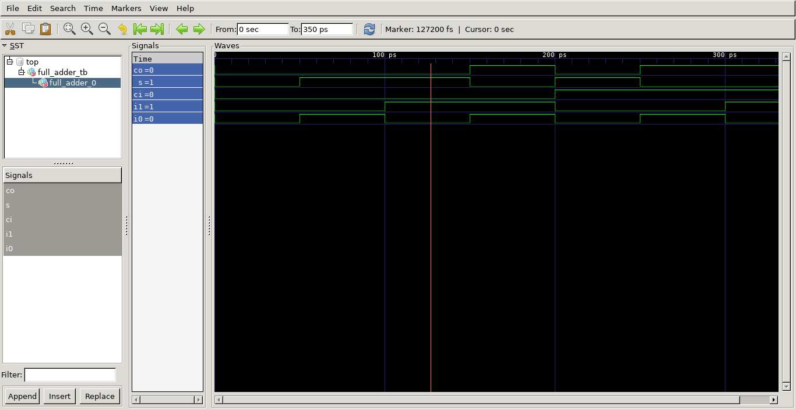
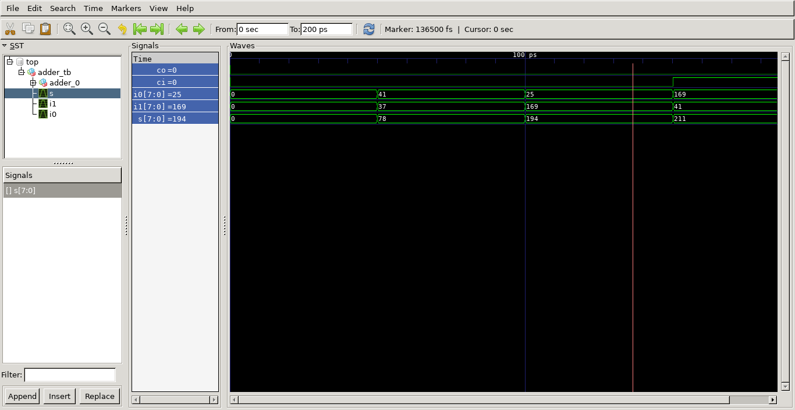
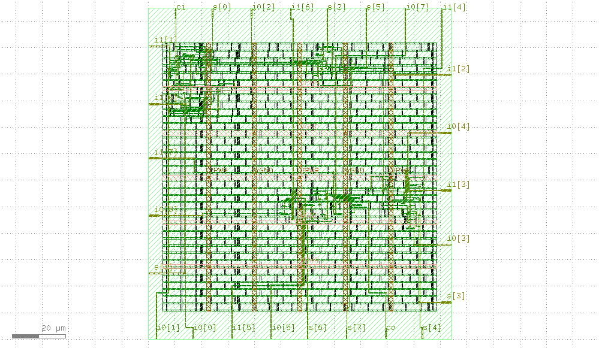

# adder
Somador em VHDL para teste do fluxo digital com front-end (ghdl + GTKwave) e back-end (openlane).

## Definição da tarefa
1. Testar o fluxo GHDL + GTKWave (Front-end) usando somador completo (Pode utilizar a referência http://ghdl.free.fr/ghdl/A-full-adder.html)
2. Utilizar Yosys + GHDL para converter o código para um .v (Verilog) equivalente, de modo a utilizar no fluxo openlane. (Ver e-mail e referências com write_verilog: https://github.com/ghdl/ghdl/issues/1174)
3. Utilizar o openlane (Back-end) para gerar o layout (.gds) por meio do .v (design file). Refs: https://github.com/britovski/vsdOpenLANE e https://github.com/efabless/openlane
4. Documentar no repositório.

## Somador


O sistema consistiu na implementação do clássico projeto de somador digital.

### Arquivos

Arquivo    | Descrição
---------- | ------
full_adder | Descrição do comportamento do clássico circuito somador-completo.
full_adder_tb  | Testbench do somador completo.
adder  | Decrição de um somador clássico de 8 bits, implementado a partir do somador completo.
adder_tb  | Testbench do somador de 8 bits.

### Simulações

#### Requisitos

- [GHDL](http://ghdl.free.fr/)

#### Procedimento

```bash

# Análise dos arquivos de descrição
$ ghdl -a ./src/vhdl/full_adder.vhdl
$ ghdl -a ./src/vhdl/adder.vhdl

# Análise dos arquivos de testes
$ ghdl -a ./src/vhdl/full_tb.vhdl
$ ghdl -a ./src/vhdl/adder_tb.vhdl

# Elaboração de unidades de testes
$ ghdl -e full_adder_tb
$ ghdl -e adder_tb

# Executar simulação e exportar formas de ondas
$ ghdl -r full_adder_tb --wave=./waves/full_adder_tb.ghw
$ ghdl -r adder_tb --wave=./waves/adder_tb.ghw

```

### Formas de ondas

#### Requisitos

- [GTKWave](http://gtkwave.sourceforge.net/)

#### Procedimento

```bash 

# full_adder
$ gtkwave ./waves/full_adder_tb.ghw

# adder
$ gtkwave ./waves/adder_tb.ghw

```

#### Screenshots





### VHDL -> Verilog

#### Requisitos

- [Yosys](http://www.clifford.at/yosys/)
- [GHDL](http://ghdl.free.fr/)
- [ghdl-yosys-plugin](https://github.com/ghdl/ghdl-yosys-plugin)

#### Procedimento

```bash

# full_adder
$ yosys -m ghdl -p 'ghdl ./src/vhdl/full_adder.vhdl -e full_adder; write_verilog full_adder.v'

# adder
$ yosys -m ghdl -p 'ghdl ./src/vhdl/adder.vhdl -e adder; write_verilog adder.v'

```

#### Observações

Devido a problemas durante a instalação do [ghdl-yosys-plugin](https://github.com/ghdl/ghdl-yosys-plugin), a imagem [hdlc/ghdl:yosys](https://hub.docker.com/r/hdlc/ghdl/tags) e o [Docker](https://www.docker.com/) foram utilizados para a execução do procedimento acima.

```bash

# Montar container
$ docker run --rm -it -v $(pwd):/home -w /home -u $(id -u $USER):$(id -g $USER) hdlc/ghdl:yosys bash

# Executar comandos dentro do container
$ yosys -m ghdl -p 'ghdl ./full_adder.vhdl -e full_adder; write_verilog full_adder.v'
$ yosys -m ghdl -p 'ghdl ./adder.vhdl -e adder; write_verilog adder.v'

```

### Verilog -> GDSII

#### Requisitos

- [Openlane](https://github.com/efabless/openlane)
- [Docker](https://www.docker.com/)

#### Procedimento

```bash

# Acessar local de instalação do Openlane
cd ~/sky130_skel/openlane

# Montar container da imagem openlane:rc6 
$ docker run --rm -it -v $(pwd):/openLANE_flow -v $PDK_ROOT:$PDK_ROOT -e PDK_ROOT=$PDK_ROOT -u $(id -u $USER):$(id -g $USER) openlane:rc6 

# Iniciar novo design 'adder'
$ ./flow -design adder -init_design_config

# Sair do container
$ exit
```

Após o procedimento acima, o arquivo `./designs/adder/config.tcl` deve ser editado conforme o presente [neste repositório](./config.tcl). Ademais, como o design é muito pequeno, problemas podem ocorrer no estágio de *placement*, conforme explicado [nesta seção](https://github.com/efabless/openlane/wiki#how-to-add-a-small-design) da documentação Openlane, dessa forma, as seguintes configurações foram necessárias:

```bash

# configuração adicionada ao arquivo: ./configuration/floorplan.tcl [relativo ao diretório do openlane]
set ::env(FP_CORE_UTIL) 5

# configuração adicionada ao arquivo: ./configuration/placement.tcl [relativo ao diretório do openlane]
set ::env(PL_TARGET_DENSITY) 0.5

```

Após essas configurações, é necessário acessar a raiz desse repositório e seguir com o restante do procedimento:

```bash

# Copiar arquivos 'Verilog' para a pasta do design
$ cp -r ./src/verilog ~/sky130_skel/openlane/designs/adder/src

# Acessar local de instalação do Openlane
$ cd ~/sky130_skel/openlane

# Iniciar fluxo
$ docker run --rm -v $(pwd):/openLANE_flow -v $PDK_ROOT:$PDK_ROOT -e PDK_ROOT=$PDK_ROOT -u $(id -u $USER):$(id -g $USER) openlane:rc6 ./flow -design adder -tag openlane_run

```

#### Screenshots


<p align="center">staydh - 2021</p>
